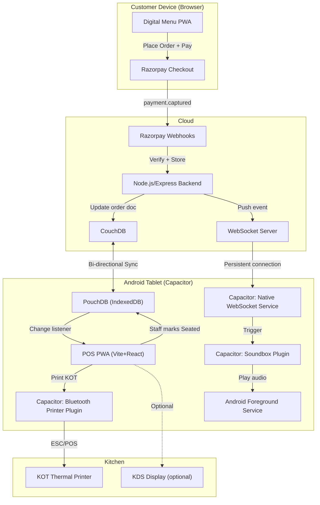
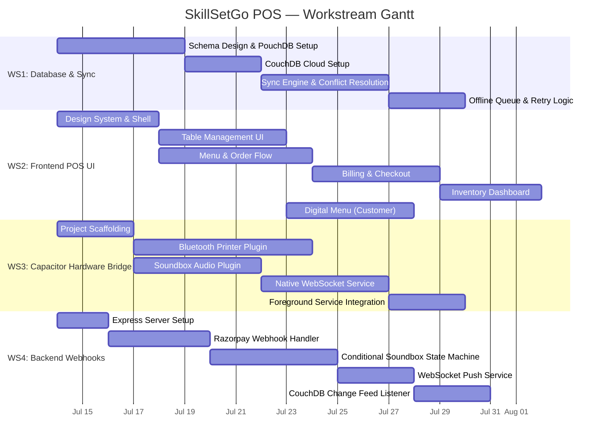
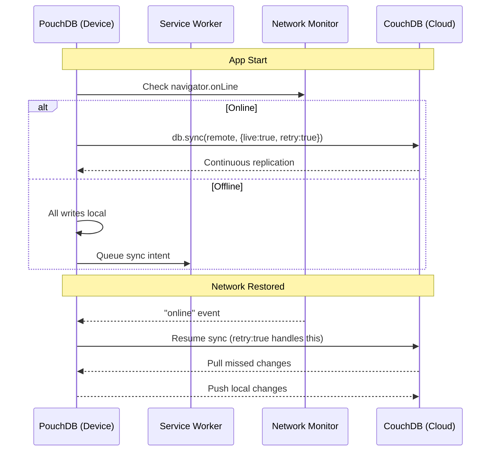
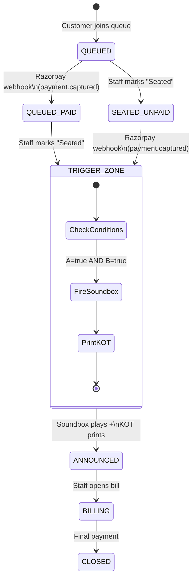
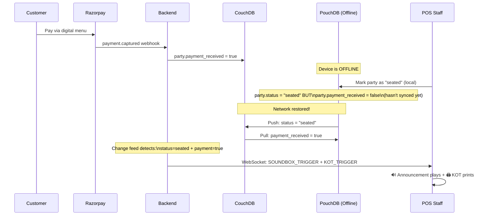

# SkillSetGo POS — Full Implementation Plan

A Petpooja/myBillBook-class POS & restaurant management system built offline-first with React/Next.js PWA, PouchDB↔CouchDB sync, Capacitor Android wrapper, and proprietary hardware integrations (Virtual Soundbox & Thermal Printing).

---

## User Review Required

> [!IMPORTANT]
> **Next.js vs. Vite for PWA:** Next.js is server-centric by design (SSR, API routes). For a truly offline-first PWA wrapped in Capacitor, this creates friction — Capacitor serves static files from `file://`, which means SSR is unavailable on-device. I recommend **Vite + React** (SPA) instead, which produces a clean static bundle that maps perfectly to Capacitor's model and the offline-first requirement. Next.js API routes can still be used for the cloud backend separately. **Do you want to proceed with Vite + React (recommended) or stay with Next.js?**

> [!WARNING]
> **CouchDB as the only cloud database:** CouchDB excels at sync but is weak for analytics, relational queries (multi-outlet aggregation, GST reports across chains), and webhook-triggered lookups. I recommend adding a **lightweight PostgreSQL** (or even SQLite on the server) as a read-optimized projection for reports and webhook state management, fed by CouchDB change feeds. **Is a secondary reporting DB acceptable, or do you want to keep it CouchDB-only?**

> [!IMPORTANT]
> **Razorpay + Offline Conflict:** If a customer pays via the digital menu while the POS tablet is offline, the webhook arrives at the server but can't push to the device. When the device comes online and syncs, there's a race between the sync completing and the staff marking "Seated." The plan below handles this via a server-side state machine, but **please confirm: should the Soundbox announcement play immediately on reconnect if the party was already marked Seated while offline, or should staff manually re-trigger it?**

---

## Open Questions

These are blocking or semi-blocking decisions I need your input on before executing:

| # | Question | Impact |
|---|----------|--------|
| Q1 | **Multi-outlet support from Day 1?** Petpooja supports chain-wide management. Should the schema support `outlet_id` partitioning now, or is this single-outlet initially? | Schema design, CouchDB database-per-outlet strategy |
| Q2 | **Digital Menu scope:** Is this a full customer-facing web app (QR → browse menu → add to cart → pay), or a simpler "scan QR, see menu, call waiter" flow? | Determines if we need a separate public-facing frontend |
| Q3 | **GST/Tax regime:** India-specific GST with CGST+SGST+IGST breakdown? Should the system generate e-invoices or integrate with GST portals? | Tax calculation engine complexity |
| Q4 | **Aggregator integration (Swiggy/Zomato)?** Petpooja's killer feature. Is this in scope for V1 or deferred? | Adds a 5th workstream for aggregator webhooks |
| Q5 | **KDS (Kitchen Display System)?** Should the kitchen have a separate screen/tablet showing live orders, or is printed KOT sufficient for V1? | Adds a dedicated KDS frontend module |
| Q6 | **User auth model:** Cloud-based login (email/OTP) with offline session caching, or device-pinned PINs (like a restaurant terminal)? | Auth architecture, role-based access |
| Q7 | **Inventory granularity:** Track ingredients at raw-material level (kg of rice, liters of oil) with recipe-based auto-deduction, or simpler SKU-level stock counts? | Inventory schema complexity |
| Q8 | **Soundbox audio source:** Pre-recorded TTS files per amount ("Received five hundred rupees"), or real-time TTS synthesis on the Android device? | Audio asset management vs. TTS engine integration |

---

## System Architecture Overview



---

## Parallel Workstreams

### Workstream Map & Dependencies



---

## WS1: Database & Sync Layer

### 1.1 PouchDB/CouchDB Polymorphic Schema

All documents share a single PouchDB database with a `type` discriminator field and prefixed `_id` values.

#### Document ID Convention
```
{type}:{outlet_id}:{ulid}

Examples:
  item:OUT001:01J5KXYZ...     → Menu item
  order:OUT001:01J5KXYZ...    → Order
  table:OUT001:01J5KXYZ...    → Table/seating
  party:OUT001:01J5KXYZ...    → Party (queue → seated flow)
  inventory:OUT001:01J5KXYZ...→ Inventory record
```

> [!NOTE]
> Using ULID (Universally Unique Lexicographically Sortable Identifier) instead of UUID for `_id` ensures chronological ordering in `allDocs` queries without secondary indexes.

#### Polymorphic Item Schema

```typescript
// ──── BASE ITEM (shared fields) ────
interface BaseItem {
  _id: string;               // "item:OUT001:01J5..."
  _rev?: string;
  type: "item";
  schema_version: 1;

  // ─── Identity ───
  name: string;              // "Chicken Biryani"
  display_name?: string;     // Override for digital menu
  sku?: string;              // Optional barcode/SKU
  category_id: string;       // Ref → category doc
  tags: string[];            // ["bestseller", "spicy"]

  // ─── Pricing ───
  base_price: number;        // In paise (₹250 = 25000)
  tax_config: {
    tax_group_id: string;    // Ref → tax_group doc
    is_inclusive: boolean;    // Price includes tax?
  };

  // ─── Availability ───
  is_available: boolean;
  available_channels: ("dine_in" | "takeaway" | "delivery" | "digital_menu")[];
  outlet_id: string;

  // ─── Polymorphic Discriminator ───
  item_kind: "simple" | "recipe" | "combo" | "variant_parent";

  // ─── Variant System ───
  variants?: ItemVariant[];       // Only if item_kind === "variant_parent"
  addon_group_ids?: string[];     // Ref → addon_group docs

  // ─── Metadata ───
  sort_order: number;
  image_url?: string;
  created_at: string;        // ISO 8601
  updated_at: string;
  is_deleted: boolean;       // Soft delete for sync
}

// ──── SIMPLE ITEM (retail, beverages) ────
interface SimpleItem extends BaseItem {
  item_kind: "simple";
  inventory_tracking: {
    track: boolean;
    unit: "pcs" | "kg" | "litre" | "ml" | "g";
    current_stock: number;
    low_stock_alert: number;
    inventory_item_id?: string;  // Ref → raw inventory doc
  };
}

// ──── RECIPE ITEM (kitchen-prepared) ────
interface RecipeItem extends BaseItem {
  item_kind: "recipe";
  recipe: {
    yield_qty: number;           // Servings per batch
    yield_unit: string;
    ingredients: RecipeIngredient[];
    prep_time_minutes?: number;
    instructions?: string;
  };
}

interface RecipeIngredient {
  inventory_item_id: string;     // Ref → raw inventory doc
  name: string;                  // Denormalized for offline display
  quantity: number;              // Per single serving
  unit: "g" | "kg" | "ml" | "litre" | "pcs";
  waste_percentage?: number;     // e.g., 5 for 5% waste
}

// ──── COMBO ITEM ────
interface ComboItem extends BaseItem {
  item_kind: "combo";
  combo: {
    components: {
      item_id: string;           // Ref → any item doc
      quantity: number;
      is_optional: boolean;
    }[];
    combo_discount: number;      // Discount in paise
  };
}

// ──── VARIANT PARENT (e.g., Pizza → Small/Medium/Large) ────
interface VariantParentItem extends BaseItem {
  item_kind: "variant_parent";
  variants: ItemVariant[];
}

interface ItemVariant {
  variant_id: string;
  name: string;                  // "Large", "Regular"
  price_override: number;        // Absolute price in paise
  sku?: string;
  inventory_tracking?: SimpleItem["inventory_tracking"];
}

// ──── DISCRIMINATED UNION ────
type PolymorphicItem = SimpleItem | RecipeItem | ComboItem | VariantParentItem;
```

#### Other Core Document Types

```typescript
// ──── ORDER ────
interface OrderDoc {
  _id: string;                   // "order:OUT001:01J5..."
  type: "order";
  party_id: string;              // Ref → party doc
  table_id?: string;
  order_number: string;          // Human-readable: "ORD-0042"
  status: "draft" | "confirmed" | "preparing" | "served" | "billed" | "closed" | "cancelled";
  order_type: "dine_in" | "takeaway" | "delivery" | "digital_menu";

  items: OrderLineItem[];

  subtotal: number;              // Paise
  tax_breakdown: TaxLine[];
  discount?: DiscountLine;
  total: number;
  
  payments: PaymentLine[];
  payment_status: "unpaid" | "partially_paid" | "paid" | "refunded";

  kot_printed: boolean;
  kot_printed_at?: string;
  soundbox_played: boolean;
  soundbox_played_at?: string;

  created_at: string;
  updated_at: string;
  created_by: string;            // Staff user ID
  outlet_id: string;
  is_deleted: boolean;
}

interface OrderLineItem {
  line_id: string;               // ULID for this line
  item_id: string;
  item_name: string;             // Denormalized
  item_kind: "simple" | "recipe" | "combo" | "variant";
  variant_id?: string;
  quantity: number;
  unit_price: number;
  addons: { addon_id: string; name: string; price: number }[];
  special_instructions?: string;
  kot_status: "pending" | "sent" | "preparing" | "ready" | "served";
}

// ──── PARTY (Queue → Seated flow) ────
interface PartyDoc {
  _id: string;                   // "party:OUT001:01J5..."
  type: "party";
  party_name: string;            // "Table 5" or customer name
  party_size: number;
  status: "queued" | "seated" | "billing" | "closed";
  table_id?: string;             // Assigned on seating

  // ─── Conditional Soundbox State ───
  payment_received: boolean;     // Set true by webhook sync
  payment_id?: string;           // Razorpay payment ID
  payment_amount?: number;
  seated_at?: string;            // ISO timestamp
  soundbox_triggered: boolean;   // Has announcement played?
  kot_triggered: boolean;        // Has KOT been sent?

  // ─── Digital Menu Pre-Order ───
  pre_order_items: OrderLineItem[];  // Items selected before seating

  queue_token?: string;          // "Q-007"
  created_at: string;
  updated_at: string;
  outlet_id: string;
  is_deleted: boolean;
}

// ──── TABLE ────
interface TableDoc {
  _id: string;
  type: "table";
  table_number: string;
  section: string;               // "Ground Floor", "Terrace"
  capacity: number;
  status: "available" | "occupied" | "reserved" | "blocked";
  current_party_id?: string;
  outlet_id: string;
  is_deleted: boolean;
}

// ──── RAW INVENTORY ────
interface InventoryDoc {
  _id: string;
  type: "inventory";
  name: string;                  // "Basmati Rice"
  unit: "g" | "kg" | "ml" | "litre" | "pcs";
  current_stock: number;
  low_stock_threshold: number;
  cost_per_unit: number;         // Paise
  supplier?: string;
  outlet_id: string;
  updated_at: string;
  is_deleted: boolean;
}
```

### 1.2 Sync Architecture



#### Conflict Resolution Strategy

| Document Type | Strategy | Rationale |
|---------------|----------|-----------|
| `order` (line items) | **Semantic merge** — union of `items[]` arrays, dedup by `line_id` | Two waiters adding items simultaneously should both succeed |
| `order` (status) | **Last-write-wins with timestamp** | Status transitions are sequential; latest is correct |
| `party` (status) | **Server-wins** | Payment state from webhooks is authoritative |
| `table` (status) | **Last-write-wins** | Single-device typically manages tables |
| `inventory` (stock) | **CRDT-style delta merge** — store operations as increments, not absolutes | Prevents lost deductions from concurrent sales |
| `item` (catalog) | **Last-write-wins** | Menu edits are infrequent admin operations |

### 1.3 PouchDB Indexes

```javascript
// Index for fetching all items by category
{ index: { fields: ['type', 'outlet_id', 'category_id', 'sort_order'] } }

// Index for active orders
{ index: { fields: ['type', 'outlet_id', 'status', 'created_at'] } }

// Index for party queue
{ index: { fields: ['type', 'outlet_id', 'status', 'created_at'] } }

// Index for tables by section
{ index: { fields: ['type', 'outlet_id', 'section', 'table_number'] } }

// Index for inventory alerts
{ index: { fields: ['type', 'outlet_id', 'current_stock'] } }
```

---

## WS2: Frontend POS UI

### 2.1 Tech Stack

| Layer | Choice | Rationale |
|-------|--------|-----------|
| Build | **Vite 6** | Fast HMR, clean static output for Capacitor |
| Framework | **React 19** | Component model, ecosystem |
| Routing | **React Router 7** | Client-side SPA routing |
| State | **Zustand** | Lightweight, no boilerplate, works offline |
| DB Layer | **PouchDB + custom hooks** | `useLiveQuery()` for reactive UI |
| PWA | **Serwist** (vite plugin) | Service worker caching |
| UI Kit | **Custom design system** | Restaurant-optimized touch targets |
| Styling | **Vanilla CSS + CSS custom properties** | Per your stack requirements |

### 2.2 Application Shell & Routing

```
/                          → Dashboard (today's sales, active tables, alerts)
/tables                    → Table grid (visual floor plan)
/tables/:tableId           → Table detail → active order
/queue                     → Party queue management
/orders                    → Order list (filterable by status)
/orders/:orderId           → Order detail / billing
/menu                      → Menu management (CRUD items)
/menu/categories           → Category management
/inventory                 → Inventory dashboard
/inventory/recipes         → Recipe builder
/reports                   → Sales, tax, inventory reports
/settings                  → Printer setup, soundbox config, sync status
/settings/staff            → Staff management & roles

/digital-menu/:outletId    → Customer-facing menu (separate route group)
```

### 2.3 Key UI Components

| Component | Description |
|-----------|-------------|
| `<TableGrid>` | Visual grid/floor-plan of tables with status colors (green=free, red=occupied, yellow=reserved) |
| `<OrderPanel>` | Split-screen: left = menu items grid, right = current order with line items |
| `<PartyQueue>` | Kanban-style board: Queued → Seated → Billing → Closed |
| `<BillPreview>` | Receipt-style bill with tax breakdown, print button |
| `<SyncIndicator>` | Persistent status pill: 🟢 Synced / 🟡 Syncing / 🔴 Offline |
| `<PrinterSetup>` | Bluetooth device scanner, test print, saved printers list |
| `<SoundboxLog>` | History of soundbox announcements with replay button |
| `<InventoryAlert>` | Toast notifications for low-stock items |
| `<MenuBuilder>` | Polymorphic form that adapts based on `item_kind` selection |

### 2.4 Offline UX Patterns

- **Optimistic writes:** Every action (add item, change table status) writes to PouchDB first → UI updates instantly.
- **Sync badge:** Persistent indicator showing pending changes count when offline.
- **Graceful degradation:** Features requiring cloud (reports aggregation, digital menu payments) show "Available when online" messaging.
- **Offline bill numbering:** Sequential bill numbers use device-local counters with outlet prefix to prevent collisions: `SSG-DEV01-00042`.

---

## WS3: Capacitor Hardware Bridge

### 3.1 Project Structure

```
android/
├── app/src/main/java/com/skillsetgo/pos/
│   ├── plugins/
│   │   ├── BluetoothPrinterPlugin.kt      ← Capacitor plugin
│   │   ├── SoundboxPlugin.kt              ← Capacitor plugin
│   │   └── NativeWebSocketPlugin.kt       ← Capacitor plugin
│   ├── services/
│   │   ├── PrinterService.kt              ← ESC/POS command builder
│   │   ├── SoundboxForegroundService.kt   ← Android Foreground Service
│   │   └── WebSocketService.kt            ← OkHttp WebSocket client
│   └── MainActivity.kt
├── app/src/main/AndroidManifest.xml
└── capacitor.config.ts
```

### 3.2 Bluetooth Thermal Printer Plugin

```typescript
// ──── TypeScript Interface (Web → Native) ────
interface BluetoothPrinterPlugin {
  // Discovery
  scanDevices(): Promise<{ devices: BTPrinterDevice[] }>;
  connectDevice(opts: { address: string }): Promise<void>;
  disconnectDevice(): Promise<void>;
  getConnectionStatus(): Promise<{ connected: boolean; deviceName?: string }>;

  // Printing
  printRaw(opts: { data: number[] }): Promise<void>;        // Raw ESC/POS bytes
  printText(opts: { text: string; bold?: boolean; align?: 'left'|'center'|'right'; size?: 1|2 }): Promise<void>;
  printReceipt(opts: { receiptHtml: string }): Promise<void>; // HTML → bitmap → ESC/POS
  printKOT(opts: { kotData: KOTPayload }): Promise<void>;    // Structured KOT

  feedPaper(opts: { lines: number }): Promise<void>;
  cutPaper(): Promise<void>;

  // Events
  addListener(event: 'printerDisconnected', handler: () => void): Promise<void>;
}

interface KOTPayload {
  order_number: string;
  table_number: string;
  items: { name: string; qty: number; notes?: string }[];
  timestamp: string;
  kot_number: number;
}
```

**Native Implementation (Kotlin):**
- Use Android `BluetoothAdapter` for Classic Bluetooth (most thermal printers use SPP, not BLE).
- Build ESC/POS command sequences as `ByteArray`.
- Handle permissions: `BLUETOOTH_CONNECT`, `BLUETOOTH_SCAN` (Android 12+), `ACCESS_FINE_LOCATION` (for scanning).
- Implement auto-reconnect with exponential backoff.

### 3.3 Virtual Soundbox Plugin

```typescript
interface SoundboxPlugin {
  // Playback
  playAnnouncement(opts: {
    amount: number;              // In paise
    paymentMethod: string;       // "UPI", "Card", "Cash"
    customerName?: string;
  }): Promise<void>;

  // Audio management
  setVolume(opts: { level: number }): Promise<void>;  // 0.0 → 1.0
  stopPlayback(): Promise<void>;
  preloadAudioPack(): Promise<void>;                  // Cache TTS files

  // Events
  addListener(event: 'playbackComplete', handler: () => void): Promise<void>;
  addListener(event: 'playbackError', handler: (err: { message: string }) => void): Promise<void>;
}
```

**Native Implementation (Kotlin):**
- Use `MediaPlayer` or `ExoPlayer` for audio playback.
- Audio files: Pre-recorded number segments (e.g., "one", "hundred", "rupees") concatenated at runtime to form "Received two hundred fifty rupees via UPI."
- Runs inside `SoundboxForegroundService` with `FOREGROUND_SERVICE_MEDIA_PLAYBACK` permission.
- Persistent notification: "SkillSetGo POS — Listening for payments."

### 3.4 Native WebSocket Service

```typescript
interface NativeWebSocketPlugin {
  connect(opts: { url: string; token: string }): Promise<void>;
  disconnect(): Promise<void>;
  getStatus(): Promise<{ connected: boolean }>;

  // Events
  addListener(event: 'message', handler: (data: { payload: string }) => void): Promise<void>;
  addListener(event: 'connected', handler: () => void): Promise<void>;
  addListener(event: 'disconnected', handler: (reason: { code: number }) => void): Promise<void>;
}
```

**Native Implementation (Kotlin):**
- Use **OkHttp WebSocket** client running inside the Foreground Service.
- Auto-reconnect with exponential backoff (1s → 2s → 4s → max 30s).
- Heartbeat ping every 30 seconds.
- On `message` event, use Capacitor's `notifyListeners()` to push data to the WebView.

### 3.5 Android Manifest Requirements

```xml
<uses-permission android:name="android.permission.BLUETOOTH" />
<uses-permission android:name="android.permission.BLUETOOTH_ADMIN" />
<uses-permission android:name="android.permission.BLUETOOTH_CONNECT" />
<uses-permission android:name="android.permission.BLUETOOTH_SCAN" />
<uses-permission android:name="android.permission.ACCESS_FINE_LOCATION" />
<uses-permission android:name="android.permission.FOREGROUND_SERVICE" />
<uses-permission android:name="android.permission.FOREGROUND_SERVICE_MEDIA_PLAYBACK" />
<uses-permission android:name="android.permission.WAKE_LOCK" />
<uses-permission android:name="android.permission.INTERNET" />
<uses-permission android:name="android.permission.ACCESS_NETWORK_STATE" />
```

---

## WS4: Backend Webhooks & State Machine

### 4.1 Server Stack

```
backend/
├── src/
│   ├── server.ts                    ← Express entry point
│   ├── routes/
│   │   ├── webhook.razorpay.ts      ← Razorpay webhook handler
│   │   ├── api.orders.ts            ← REST API for digital menu
│   │   └── api.health.ts
│   ├── services/
│   │   ├── payment.service.ts       ← Payment verification & state
│   │   ├── soundbox.service.ts      ← Conditional trigger logic
│   │   └── sync.service.ts          ← CouchDB change feed listener
│   ├── websocket/
│   │   ├── ws.server.ts             ← WebSocket server (ws library)
│   │   └── ws.auth.ts               ← Token-based WS auth
│   ├── db/
│   │   ├── couch.client.ts          ← nano (CouchDB client)
│   │   └── event-store.ts           ← Idempotency tracking
│   └── config/
│       └── env.ts
├── package.json
└── Dockerfile
```

### 4.2 Conditional Soundbox — Full State Machine

This is the core of Q2. The soundbox + KOT trigger requires **two conditions to be true simultaneously**:

```
CONDITION A: payment_received === true   (set by Razorpay webhook)
CONDITION B: party.status === "seated"   (set by staff on POS)
```

Only when **A AND B** are both true does the system trigger:
1. WebSocket push → Android Soundbox audio
2. KOT generation → Bluetooth printer



### 4.3 Implementation Flow

```typescript
// ──── Razorpay Webhook Handler ────
// POST /webhooks/razorpay
async function handleRazorpayWebhook(req, res) {
  // 1. Verify HMAC signature (MUST use raw body)
  const isValid = verifyRazorpaySignature(req.body, req.headers['x-razorpay-signature']);
  if (!isValid) return res.status(400).send('Invalid signature');
  
  // 2. Idempotency check
  const eventId = req.headers['x-razorpay-event-id'];
  if (await eventStore.exists(eventId)) return res.status(200).send('Already processed');
  
  // 3. Parse and respond immediately (Razorpay timeout = 5s)
  res.status(200).send('OK');
  
  // 4. Process asynchronously
  const event = JSON.parse(req.body.toString());
  if (event.event === 'payment.captured') {
    await processPaymentCaptured(event.payload.payment.entity);
  }
}

async function processPaymentCaptured(payment) {
  const partyId = payment.notes.party_id;     // Embedded in Razorpay order
  const outletId = payment.notes.outlet_id;
  
  // 5. Update party doc in CouchDB
  const partyDoc = await couchDB.get(partyId);
  partyDoc.payment_received = true;
  partyDoc.payment_id = payment.id;
  partyDoc.payment_amount = payment.amount;
  partyDoc.updated_at = new Date().toISOString();
  await couchDB.put(partyDoc);
  
  // 6. CHECK TRIGGER CONDITION
  await checkAndTriggerSoundbox(partyDoc);
  
  // 7. Mark event processed
  await eventStore.save(eventId);
}

// ──── Conditional Trigger Check ────
// Called from TWO places:
//   a) After Razorpay webhook updates party
//   b) After CouchDB change feed detects party.status → "seated"
async function checkAndTriggerSoundbox(partyDoc) {
  if (
    partyDoc.payment_received === true &&
    partyDoc.status === 'seated' &&
    partyDoc.soundbox_triggered === false    // Prevent double-fire
  ) {
    // ── FIRE SOUNDBOX ──
    websocketServer.sendToOutlet(partyDoc.outlet_id, {
      type: 'SOUNDBOX_TRIGGER',
      payload: {
        party_id: partyDoc._id,
        amount: partyDoc.payment_amount,
        payment_method: 'UPI',     // From Razorpay payment.method
        customer_name: partyDoc.party_name,
      }
    });

    // ── FIRE KOT ──
    websocketServer.sendToOutlet(partyDoc.outlet_id, {
      type: 'KOT_TRIGGER',
      payload: {
        party_id: partyDoc._id,
        items: partyDoc.pre_order_items,
        table_id: partyDoc.table_id,
      }
    });

    // ── Update flags ──
    partyDoc.soundbox_triggered = true;
    partyDoc.kot_triggered = true;
    partyDoc.updated_at = new Date().toISOString();
    await couchDB.put(partyDoc);
  }
}
```

### 4.4 CouchDB Change Feed Listener

This is the **second trigger path** — when the POS device (offline) marks a party as "seated" and that change syncs to CouchDB:

```typescript
// ──── CouchDB Changes Feed ────
const feed = couchDB.follow({ since: 'now', live: true, include_docs: true });

feed.on('change', async (change) => {
  if (change.doc.type === 'party' && change.doc.status === 'seated') {
    // Staff just marked this party as seated (via sync from POS device)
    await checkAndTriggerSoundbox(change.doc);
  }
});
```

### 4.5 Android-Side WebSocket Handling

```typescript
// ──── In React app (runs inside Capacitor WebView) ────
NativeWebSocketPlugin.addListener('message', async (data) => {
  const msg = JSON.parse(data.payload);

  switch (msg.type) {
    case 'SOUNDBOX_TRIGGER':
      await SoundboxPlugin.playAnnouncement({
        amount: msg.payload.amount,
        paymentMethod: msg.payload.payment_method,
        customerName: msg.payload.customer_name,
      });
      break;

    case 'KOT_TRIGGER':
      await BluetoothPrinterPlugin.printKOT({
        order_number: msg.payload.order_number,
        table_number: msg.payload.table_number,
        items: msg.payload.items.map(i => ({
          name: i.item_name,
          qty: i.quantity,
          notes: i.special_instructions,
        })),
        timestamp: new Date().toISOString(),
        kot_number: await getNextKOTNumber(),
      });
      break;
  }
});
```

### 4.6 Offline Edge Case: "Seated While Offline"



---

## Directory Structure (Full Project)

```
e:\SkillSetGo - POS\
├── apps/
│   ├── pos/                         ← Vite + React POS PWA
│   │   ├── public/
│   │   │   ├── manifest.json
│   │   │   └── sw.js
│   │   ├── src/
│   │   │   ├── main.tsx
│   │   │   ├── App.tsx
│   │   │   ├── router.tsx
│   │   │   ├── db/                  ← PouchDB layer
│   │   │   │   ├── pouchdb.ts       ← DB init + sync setup
│   │   │   │   ├── schemas.ts       ← TypeScript interfaces
│   │   │   │   ├── hooks.ts         ← useLiveQuery, useDoc
│   │   │   │   ├── indexes.ts       ← Mango index definitions
│   │   │   │   └── conflicts.ts     ← Conflict resolvers
│   │   │   ├── stores/              ← Zustand stores
│   │   │   ├── components/          ← UI components
│   │   │   ├── pages/               ← Route pages
│   │   │   ├── plugins/             ← Capacitor plugin wrappers
│   │   │   │   ├── printer.ts
│   │   │   │   ├── soundbox.ts
│   │   │   │   └── native-ws.ts
│   │   │   ├── services/            ← Business logic
│   │   │   └── styles/              ← CSS design system
│   │   ├── index.html
│   │   ├── vite.config.ts
│   │   └── capacitor.config.ts
│   │
│   ├── digital-menu/                ← Customer-facing menu (separate Vite app)
│   │   └── ...
│   │
│   └── android/                     ← Capacitor Android project
│       └── app/src/main/java/com/skillsetgo/pos/
│           ├── plugins/
│           ├── services/
│           └── MainActivity.kt
│
├── backend/
│   ├── src/
│   │   ├── server.ts
│   │   ├── routes/
│   │   ├── services/
│   │   ├── websocket/
│   │   └── db/
│   ├── package.json
│   └── Dockerfile
│
├── packages/
│   └── shared/                      ← Shared types & utils (monorepo)
│       ├── schemas.ts               ← Document type definitions
│       ├── constants.ts
│       └── utils.ts
│
├── package.json                     ← Monorepo root (npm workspaces)
├── tsconfig.base.json
└── README.md
```

---

## Verification Plan

### Automated Tests

```bash
# Unit tests — schema validation, conflict resolution, state machine
npm run test --workspace=packages/shared
npm run test --workspace=apps/pos
npm run test --workspace=backend

# Integration tests — PouchDB ↔ CouchDB sync
npm run test:integration --workspace=apps/pos

# E2E — critical flows
npm run test:e2e --workspace=apps/pos    # Playwright
```

### Manual Verification

| Test | Method |
|------|--------|
| Offline billing | Turn off WiFi on tablet → create order → bill → turn on WiFi → verify sync |
| Soundbox conditional trigger | Pay via digital menu → verify NO sound → mark seated → verify sound plays |
| KOT printing | Connect BT printer → place order → verify KOT prints with correct items |
| Conflict resolution | Two tablets edit same order offline → reconnect → verify merge |
| PWA install | Open in Chrome → verify "Add to Home Screen" prompt → verify offline launch |

---

## Risk Register

| Risk | Severity | Mitigation |
|------|----------|------------|
| PouchDB IndexedDB storage limits (~50MB default) | Medium | Implement data archival: move closed orders >30 days to CouchDB-only |
| Bluetooth printer disconnects mid-print | High | Implement print queue with retry; store failed prints for manual re-trigger |
| CouchDB conflict storms on busy nights | High | Granular document design (1 doc per line item vs. 1 doc per order); consider this in V2 |
| Razorpay webhook delivery failure | Medium | Implement polling fallback: server checks unpaid orders every 5 min via Razorpay API |
| Android kills Foreground Service | Low | Use `START_STICKY` and proper notification channel; test on aggressive OEMs (Xiaomi, Samsung) |
| Offline bill number collisions across devices | Medium | Device-prefixed counters: `DEV01-00042` + server-side dedup on sync |
